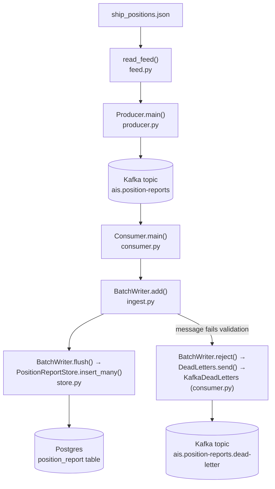
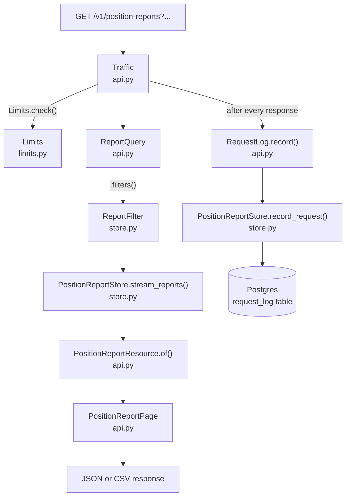

# Classes and How They Interact

A plain-language map of the important classes in this codebase, what each one is
responsible for, and how they hand work to each other. Where `CONTEXT.md` and the ADRs
answer *why* something is designed the way it is, this document answers *what exists*
and *who talks to whom*.

Two independent journeys run through this system, sharing only the database. Read them
in order — each is a straight line from one end to the other.

## Journey 1 — a record travels from the feed file to a database row

`read_feed` reads the file incrementally, one message at a time. `Producer.main`
publishes each message to Kafka unchanged. `Consumer.main` reads messages back off
Kafka, one at a time, and hands each to `BatchWriter.add`, which validates it, converts
its units, and piles reports up until 500 are collected or one second passes — only
then does `flush` actually write to Postgres. `Consumer.main`'s own loop — what actually
decides when to flush and commit, and in what order — is diagrammed in detail in
[consumer-flow.md](consumer-flow.md); it's the single hardest function in the codebase
to follow from the source alone.

### The classes in this journey

| Class / function | Plain-language role | Talks to |
|---|---|---|
| `read_feed()` (`feed.py`) | Opens the feed file and hands back one raw message at a time, instead of loading the whole file into memory. | Called by `producer.py`'s `messages_to_publish`. |
| `Producer.main()` (`producer.py`) | The command-line tool that replays the feed onto Kafka. Publishes messages as-is — no validation, no conversion. | Reads via `read_feed`; writes to the Kafka topic. |
| `PositionReport` (`domain.py`) | The one true shape of a validated observation — the thing every other class in this journey either builds, consumes, or stores. Mmsi, position, speed, all in natural units already. | Built by `from_message()`; consumed by `BatchWriter` and `PositionReportStore`. |
| `RejectedReport` (`domain.py`) | A message that failed validation, paired with the reason it failed. What actually reaches the dead-letter topic. | Built by `BatchWriter.reject()`; consumed by `DeadLetters.send()`. |
| `InvalidReport` (`domain.py`) | Not a data class — an exception. Raised by `from_message()` the moment a rule is broken (bad latitude, bad MMSI, unparseable timestamp). | Caught by `BatchWriter.add()`, which turns it into a `RejectedReport`. |
| `DeadLetters` (`ingest.py`) | Not a real class — a *description* of what "somewhere to send rejected reports" must be able to do (one method: `send`). Exists so `BatchWriter` never has to know if it's talking to Kafka or a test's in-memory list. | Implemented by `KafkaDeadLetters` in production, by a plain in-memory fake in tests. |
| `Backoff` (`ingest.py`) | The waiting schedule for a database that isn't answering: 0.5s, 1s, 2s, doubling up to 30s, forever. | Used inside `BatchWriter._write`. |
| `BatchWriter` (`ingest.py`) | The accumulator. Takes messages one at a time, validates each, and only actually writes to the database once it has 500 of them (or a second has passed). This is where "many small writes" becomes "one big write." | Calls `PositionReportStore.insert_many`; calls `DeadLetters.send` on a bad message. |
| `KafkaDeadLetters` (`consumer.py`) | The production implementation of `DeadLetters` — actually publishes a rejected message to the dead-letter Kafka topic. | Wraps a `confluent_kafka.Producer`. |
| `PositionReportStore` (`store.py`) | The only class in the codebase allowed to run SQL against `position_report`. Everything that needs data in or out of Postgres goes through here — for both this journey and Journey 2. | Talks directly to Postgres via a connection pool. |

**The one thing worth remembering about this journey:** every message is handled exactly
once by `BatchWriter`, one at a time, but only ever *written* to Postgres in a batch of
up to 500. Kafka offsets only move forward once that batch is safely on disk — that
ordering is what makes a crash mid-ingest recoverable rather than a data-loss incident
([ADR-0004](adr/0004-effectively-once-ingest-via-at-least-once-delivery.md)).

## Journey 2 — a request travels from an HTTP call to a response

`Traffic` is the front door — every request passes through it first, success or
failure, and it asks `Limits` whether this caller has used up their allowance before
anything else runs. `ReportQuery` is the URL's query parameters, parsed and validated;
`.filters()` translates that into `ReportFilter`, the datastore's own vocabulary, which
`PositionReportStore` turns into SQL and streams back one row at a time.

### The classes in this journey

| Class | Plain-language role | Talks to |
|---|---|---|
| `Traffic` (`api.py`) | The bouncer at the door. Every single request passes through this first — it checks the rate limit, times how long the request takes, and always logs it afterwards, success or failure. | Calls `Limits.check`; wraps the whole rest of the app; hands off to `RequestLog.record`. |
| `Limits` (`limits.py`) | Answers one question: "has this client IP made too many requests in the last minute?" Keeps the count in Redis, not in the API process itself, so the answer is the same no matter how many copies of the API are running. | Talks to Redis. Called only by `Traffic`. |
| `Decision` (`limits.py`) | Not logic, just an envelope — the answer `Limits.check` hands back: allowed or not, how many requests are left, how long until the window resets. | Produced by `Limits`; read by `Traffic` to decide whether to serve or refuse. |
| `ReportQuery` (`api.py`) | Everything a caller could type into the query string, gathered into one object and validated by FastAPI/Pydantic automatically — bad latitude, a limit that's too big, a radius with no centre point, all rejected before any code of ours runs. | Built by FastAPI from the raw request; converted via `.filters()` into a `ReportFilter`. |
| `ReportFilter` (`store.py`) | The same request, translated into the database's own language — SQL fragments and parameters, not web concepts. Deliberately a different object from `ReportQuery` so the datastore never has to know anything about HTTP. | Built from `ReportQuery`; consumed by `PositionReportStore`. |
| `PositionReportStore` (`store.py`) | Same class as in Journey 1 — this is the one seam everything in the whole system funnels through to reach Postgres. On the read side: turns a `ReportFilter` into `SELECT ... WHERE ...` and streams rows back without loading them all into memory. | Talks directly to Postgres. |
| `PositionReportResource` (`api.py`) | One row, dressed for public view: natural units, UTC timestamps, no database internals leaking out. | Built from a `PositionReport`; assembled into a `PositionReportPage` or a CSV row. |
| `PositionReportPage` (`api.py`) | A page of results plus `next_cursor` — the value a caller passes back as `after=` to get the next page. | Returned as the JSON response body. |
| `Problem` / `InvalidParameter` (`api.py`) | The *one* shape every error takes, regardless of what went wrong — a validation failure, an unknown route, an unhandled exception. `InvalidParameter` names the specific field at fault, when there is one. | Built by FastAPI's exception handlers inside `create_app`; returned instead of a `PositionReportPage` when something's wrong. |
| `RequestLog` (`api.py`) | Writes one row to `request_log` per request, off to the side, so a slow or failing log write can never slow down or fail the request it's describing. | Called by `Traffic` after every request; writes via `PositionReportStore.record_request`. |
| `create_app()` (`api.py`) | Not a class — the assembly function. Builds one `Limits`, one `RequestLog`, wires `Traffic` around the whole app, and opens the one `PositionReportStore` the whole application shares. This is where every class above first meets every other one. | Everything above is wired together here. |

**The one thing worth remembering about this journey:** `Traffic` sits *outside*
everything else — every request, successful or refused, passes through it, and it is
the only class that touches both `Limits` (Journey-2-only) and `RequestLog`, which
writes to the same `PositionReportStore` that Journey 1 writes Position Reports through.

## Where the two journeys meet

Exactly one place: `PositionReportStore`. Journey 1 calls `insert_many()`; Journey 2
calls `stream_reports()` and `record_request()`. Neither journey knows the other exists
— `BatchWriter` has never heard of HTTP, and `Traffic` has never heard of Kafka. That
separation is deliberate: it's what lets each side be tested completely independently
(see [docs/test-catalog.md](test-catalog.md) — the ingest seam and the HTTP seam are
exactly this split, made testable).

## "Something failed" — the four failure paths, and which class decides

| What happened | Which class notices | What it does |
|---|---|---|
| A message breaks a validation rule (bad MMSI, impossible latitude) | `from_message()` raises `InvalidReport`, caught by `BatchWriter.add()` | Dead-lettered, counted, ingest carries on. |
| Postgres is unreachable for a moment | `PositionReportStore.insert_many()` raises `TransientFailure`, caught by `BatchWriter._write()` | Retried forever with `Backoff`'s doubling schedule. Never dead-lettered — it's not the data's fault. |
| Postgres permanently refuses one row (a value too large for its column) | `PositionReportStore.insert_many()` raises `UnstorableReport` | `BatchWriter._write_separately()` isolates just that one row; the rest of the batch still lands. |
| Redis (the rate limiter) is unreachable | `Traffic._allowance()` catches the exception | Fails **open** — the request is served anyway, logged at error level ([ADR-0007](adr/0007-the-rate-limiter-fails-open.md)). |

## Quick lookup: "I want to change X"

| If you want to... | Start reading here |
|---|---|
| Change what counts as a valid Position Report | `domain.py` — `from_message()` |
| Change how many records are batched before a database write | `ingest.py` — `BatchWriter.__init__`'s `batch_size` |
| Add a new filter to the API (e.g. a new query parameter) | `api.py` — `ReportQuery`, then `store.py` — `ReportFilter` |
| Change what happens on a rate-limit refusal | `api.py` — `_too_many_requests` |
| Change a SQL query | `store.py` — `PositionReportStore` (the only class allowed to hold SQL) |
| Add a new table or column | [`db/SCHEMA.md`](../db/SCHEMA.md) and `db/001_schema.sql` |
