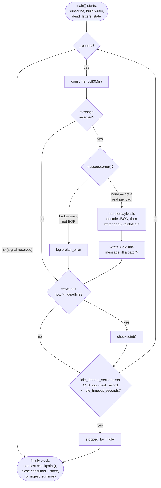
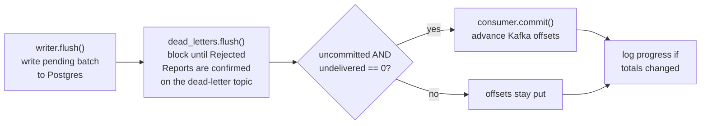

# The consumer's main loop

`consumer.py`'s `main()` is the hardest function in the codebase to read on sight: it's
one long function with no docstring, five variables mutated across loop iterations via
`nonlocal`, and a `checkpoint()` step that's called from two different places for two
different reasons. This is a dedicated flow diagram for it. For where `main()` sits in
the bigger picture, see [architecture.md](architecture.md)'s Journey 1 — this file
zooms into the one node that diagram labels `Consumer.main()`.

## The state it carries across iterations

None of this is obvious from a single read-through, since it's all local variables
closed over by the inner functions (`checkpoint`, `handle`, `progress`), not object
fields:

| Variable | Starts as | Means |
|---|---|---|
| `uncommitted` | `False` | Have messages been read since the last offset commit? |
| `deadline` | now + `ingest_batch_seconds` | When the time-bound flush should next fire |
| `last_record` | now | When a message was last actually received (for idle detection) |
| `reported` | `(0, 0)` | The `(written, rejected)` totals last logged, so progress logs only fire on change |
| `stopped_by` | `"signal"` | Why the loop ended — overwritten to `"idle"` if the idle timeout fires |
| `_running` | `True`, module-level | Flipped to `False` by the `SIGTERM`/`SIGINT` handler |

## The main loop

**Two completely independent things can trigger a checkpoint**, and this is the part
that reads as one condition but is really two:

- **The size bound** — `BatchWriter.add()` (called inside `handle`) flushes *by itself*,
  internally, the instant the batch reaches 500 records. `wrote` just reports back
  whether that already happened.
- **The time bound** — `now >= deadline`, checked on *every* loop iteration regardless
  of whether a message arrived at all. This is what flushes a half-full batch on a slow
  feed, or after a run of messages that were all rejected (rejections count toward
  `wrote` too, since `writer.add` returns truthy whenever a flush happened, not only
  when something is written).

## `checkpoint()` — the one place ADR-0004 actually happens

This function's ordering is the entire content of ADR-0004, executed as code:

**Why offsets only move here, and only under that condition:** if the process died
between `A` and `D`, the offsets were never committed, so Kafka redelivers the same
messages on restart — and the Report ID primary key silently discards the ones already
written (`ON CONFLICT DO NOTHING`). That's the entire crash-safety story from
[ADR-0004](adr/0004-effectively-once-ingest-via-at-least-once-delivery.md), and it only
works because commit is the *last* step, never an earlier one.

**Why `undelivered == 0` gates the commit, not just `uncommitted`:** if a Rejected
Report was sent to `dead_letters.send()` but genuinely never made it onto the topic
(step `B` returns a nonzero count), committing the offset anyway would mean the message
that produced that rejection is now permanently gone from Kafka **and** its dead-letter
record never arrived either — a true silent drop, the exact thing the term is defined
against in `CONTEXT.md`. Leaving the offset uncommitted means Kafka redelivers that
message on the next run, and the whole rejection gets attempted again from scratch.

`checkpoint()` is called from **two** places: inline in the loop (via the trigger
diagram above) during normal running, and once more, unconditionally, in the `finally`
block on the way out — so a graceful shutdown never leaves a full-but-unflushed batch
sitting in memory. If that final `checkpoint()` itself fails (the database is down right
as the process is asked to stop), the exception is caught, logged as
`shutdown_incomplete`, and the process exits anyway — the batch that never got written
still has its offsets uncommitted, so it's still safely sitting on the Kafka topic for
the next run to pick up.

## How it stops

Three distinct ways, and the `finally` block runs no matter which one happens:

1. **A signal** (`SIGTERM`/`SIGINT`, e.g. `docker compose stop`) flips `_running` to
   `False` via `_stop()`, which the loop notices on its next pass through `while _running`.
2. **The idle timeout** (`VT_IDLE_TIMEOUT_SECONDS`) — no message received for that many
   seconds — `break`s out of the loop directly and sets `stopped_by = "idle"`. This is
   what lets a demo run terminate on its own instead of needing to be killed
   (`test_a_consumer_given_an_idle_timeout_stops_on_its_own`).
3. **An unhandled exception** anywhere in the loop body — Python's own `finally`
   semantics guarantee the cleanup block still runs even then.

In every case: one last `checkpoint()`, close the Kafka consumer and the database pool,
then log `ingest_summary` with the final `written`/`rejected` totals and `stopped_by`.
